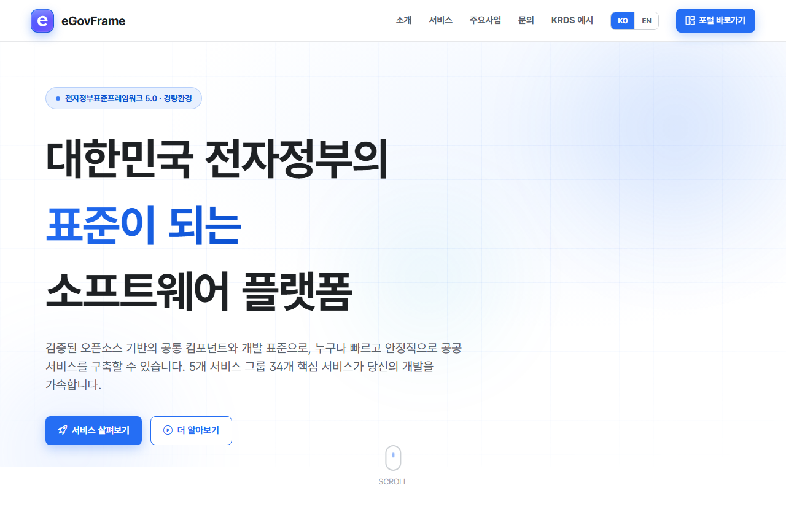
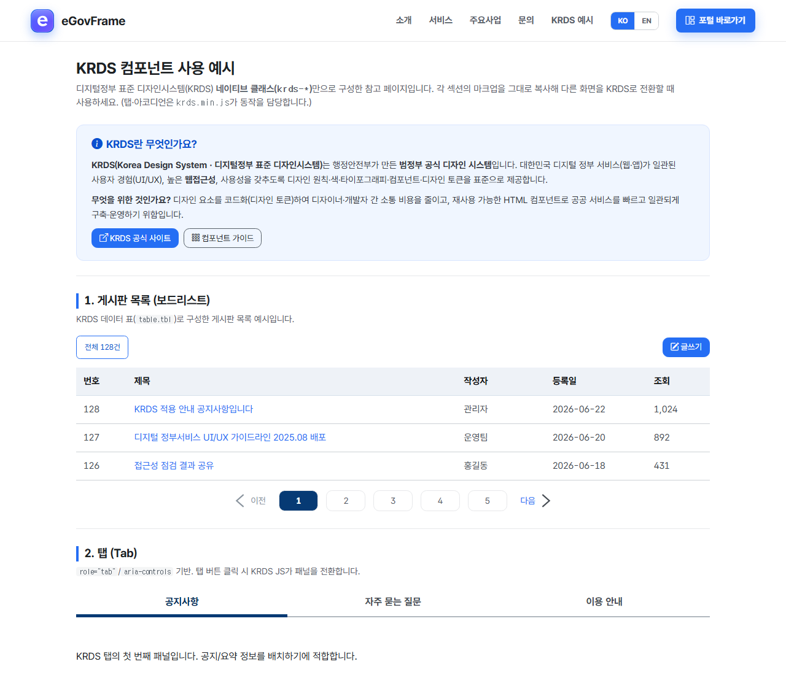
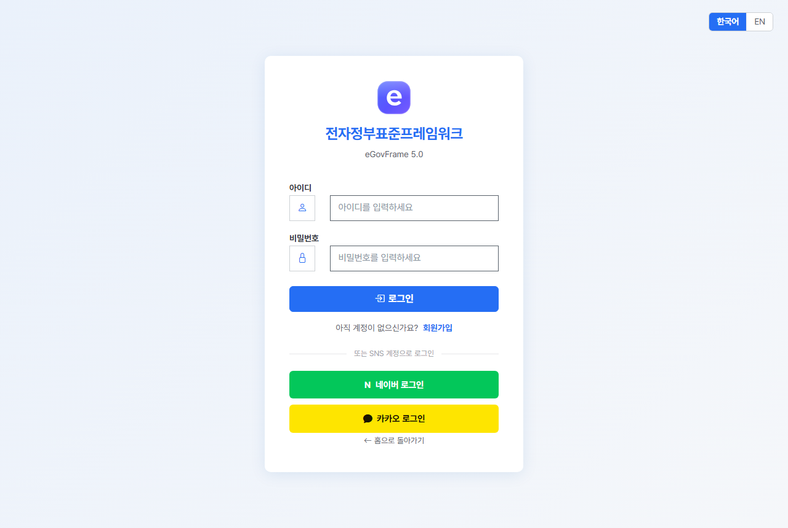

# eGovFrame 5.0 Simple Homepage


전자정부표준프레임워크(eGovFrame) 5.0 기반의 **심플 홈페이지** 예제 코드베이스입니다.
서버사이드 렌더링(**Thymeleaf MVC**)과 **REST API** 두 표현 계층을 동일한 서비스 계층 위에서 함께 제공하며,
게시판·일정·회원 등 정부 표준 공통 기능과 **KRDS(한국 정부 통합 디자인 시스템)** UI를 포함합니다.
별도 DB 서버 없이 **내장 HSQLDB**로 즉시 구동되어, 새 프로젝트의 **출발 코드베이스**로 사용하기 좋습니다.

---

## 목차
- [기술 스택](#기술-스택)
- [주요 기능](#주요-기능)
- [미리보기](#미리보기)
- [빠른 시작](#빠른-시작)
- [테스트 계정](#테스트-계정)
- [아키텍처](#아키텍처)
- [디렉터리 구조](#디렉터리-구조)
- [데이터베이스](#데이터베이스)
- [보안](#보안)
- [국제화(i18n)](#국제화i18n)
- [파일 업로드](#파일-업로드)
- [코딩·명명 규칙](#코딩명명-규칙)
- [참고 문서](#참고-문서)

---

## 기술 스택

| 구분 | 내용 |
| :--- | :--- |
| 프레임워크 | eGovFrame 5.0 (RTE) + Spring Boot 3.5.6 / Spring Framework 6.2.11 |
| 언어/런타임 | Java 17, Jakarta EE 10, Servlet 6.0 |
| 화면(SSR) | Thymeleaf + Thymeleaf Layout Dialect · **공식 KRDS**(디지털정부 표준 디자인시스템, `krds.min.css`) + KRDS 호환 레이어(`krds-compat.css`) + **Pretendard GOV** · 아이콘 Bootstrap Icons (※ Bootstrap 프레임워크 미사용) |
| 데이터 접근 | MyBatis (DBMS별 SQL 매퍼 분리) |
| 인증 | JWT (HttpOnly 쿠키 `ACCESS_TOKEN`), Spring Security (STATELESS) |
| DB | 내장 HSQLDB(기본) / MySQL · PostgreSQL · Oracle · Altibase · Tibero · CUBRID |
| 빌드 | Maven |
| API 문서 | springdoc-openapi (Swagger UI) |

---

## 주요 기능

| 기능 | 화면(MVC) | REST API | 비고 |
| :--- | :--- | :--- | :--- |
| 로그인/로그아웃 | `GET/POST /login`, `/logout` | `POST /auth/login-jwt` | JWT 쿠키 발급 |
| 메인/포털 | `GET /`, `/portal` | - | 랜딩 + 로그인 후 대시보드 |
| 게시판 CRUD | `/bbs/{bbsId}/**` | `/board/**` | 목록·상세·등록·수정·삭제, 첨부파일 |
| 게시판 마스터 | `/bbs/master/**` | - | 게시판 정의 관리 (ADMIN) |
| 게시판 사용정보 | `/bbs/use/**` | - | 게시판 사용대상 관리 (ADMIN) |
| 일정 관리 | `/schedule/**` | `/schedule/**` | 개인 일정 등록·조회·수정·삭제 |
| 회원 관리 | `/member/**` | `/etc/**` | 회원 목록·상세·수정 (ADMIN) |
| 마이페이지 | `/mypage/**` | - | 본인 정보·비밀번호 |
| 비밀번호 변경 | `/admin/password` | - | 관리자 비밀번호 (ADMIN) |
| 다국어 전환 | `GET /cmm/lang?lang=ko\|en` | - | 쿠키 기반, 한/영 |

> MVC 컨트롤러는 `Egov{기능}Controller`, REST 컨트롤러는 `Egov{기능}ApiController` 로 구분됩니다.

---

## 미리보기

전 화면이 **KRDS(디지털정부 표준 디자인시스템)** 네이티브 컴포넌트 + **Pretendard GOV** 서체로 구성됩니다.

**랜딩(홈)** — 공통 KRDS 헤더/푸터, 그라데이션 히어로


| KRDS 컴포넌트 예시(`/krds-sample`) | 로그인(`/login`) |
| :---: | :---: |
|  |  |

> KRDS 적용 상세는 [Docs/krds-적용-가이드.md](Docs/krds-적용-가이드.md), 자체검증은 `.claude/skills/krds-conversion/scripts/krds-verify.sh` 참조.

---

## 빠른 시작

### 사전 요구사항
- JDK 17
- Maven 3.9+
- (DB 불필요 — 기본 프로파일은 내장 HSQLDB를 메모리에서 자동 기동)

### 설치 (Clone)

```bash
git clone https://github.com/gjh999/simple-home-boot.git
cd simple-home-boot
```

### 실행

```bash
# 프로젝트 루트에서
mvn spring-boot:run
```

또는 IDE에서 `EgovBootApplication` 을 Spring Boot App 으로 실행합니다.

### 접속
- 홈페이지: <http://localhost:8080/>
- Swagger UI: <http://localhost:8080/swagger-ui/index.html> *(운영 프로파일에서는 비활성화)*

포트는 `src/main/resources/application.properties` 의 `server.port` 로 변경합니다.

> **Windows 8080 포트 충돌 시 종료(PowerShell)**
> ```powershell
> Get-NetTCPConnection -LocalPort 8080 -State Listen -ErrorAction SilentlyContinue |
>   ForEach-Object { Stop-Process -Id $_.OwningProcess -Force }
> ```

---

## 테스트 계정

Thymeleaf 로그인 화면(`/login`) 기준 (내장 HSQLDB 시드 데이터):

| 계정 | 아이디 | 비밀번호 | 권한 |
| :--- | :--- | :--- | :--- |
| 관리자 | `admin` | `1` | ROLE_ADMIN |
| 일반 사용자 | `user` | `user` | ROLE_USER |

> 비밀번호는 `id + password` 솔트 후 SHA-256 이중 해시로 저장됩니다(`EgovFileScrty`).
> 별도 React 프론트엔드와 연동하는 경우 클라이언트 측 1차 해싱 규약을 따릅니다.

---

## 아키텍처

```
[브라우저]
   │  (HTML, Thymeleaf SSR)        │  (JSON, REST)
   ▼                               ▼
Egov{기능}Controller        Egov{기능}ApiController
   └──────────────┬────────────────┘
                  ▼
          Service (interface) → ServiceImpl     ← @Transactional(AOP)
                  ▼
            DAO (EgovAbstractMapper)
                  ▼
         MyBatis Mapper XML (DBMS별 분리)
                  ▼
              Database
```

- **인증**: `JwtAuthenticationFilter` 가 `ACCESS_TOKEN` 쿠키의 JWT를 검증하여 `LoginVO` principal + 권한을 SecurityContext에 설정. 세션은 `STATELESS`.
- **권한**: URL 매처 기반(`SecurityConfig.filterChain`). `/admin/**`, `/bbs/master/**`, `/bbs/use/**`, `/member/**` 는 `ROLE_ADMIN`. 게시판·일정의 수정/삭제는 **작성자 본인 또는 관리자**만 가능(소유권 검사).
- **트랜잭션**: `EgovConfigAppTransaction` 의 AOP로 `*Impl.*` 메서드에 적용(쓰기 시 `Exception` 롤백).
- **공통 설정**: `egovframework.com.config` 패키지의 `EgovConfigApp*` JavaConfig 클래스들(Datasource, Mapper, IdGen, Transaction, Common 등).

---

## 디렉터리 구조

```
src/main/java/egovframework/
  com/                      # 공통(인증·파일·설정·보안·JWT)
    cmm/                    # 공통 VO·서비스·유틸 (LoginVO, EgovFileMng* 등)
    config/                 # @Configuration (Datasource, Mapper, IdGen, Tx, Common, SecretsGuard)
    jwt/                    # JWT 유틸·필터
    security/               # SecurityConfig, WebMvcConfig
  let/                      # 업무 기능
    cop/bbs/                # 게시판 (+ master/ 게시판마스터)
    cop/com/                # 게시판 사용정보
    cop/smt/sim/            # 일정관리
    main/                   # 메인/랜딩/포털
    uat/uia/                # 로그인
    uat/esm/                # 사이트(관리자) 관리
    uss/umt/                # 회원관리·마이페이지·회원가입
    utl/                    # 유틸

src/main/resources/
  egovframework/mapper/     # MyBatis XML (EgovXxx_SQL_{dbtype}.xml — DBMS별)
  egovframework/message/    # 다국어 메시지(message-ui*.properties 등)
  egovframework/validator/  # 검증 XML
  db/shtdb.sql              # 내장 HSQLDB 초기화 DDL+DML (기본 구동 시 자동 적재)
  static/                   # 정적 리소스(css/js/img — KRDS, Bootstrap, 로컬 보관)
  templates/                # Thymeleaf 템플릿
    layouts/                # default.html, login.html
    fragments/              # header, nav, footer, pagination
    let/{모듈}/             # 기능별 화면
  application*.properties   # 환경 설정(base / -dev / -prod)

DATABASE/                   # 배포용 DBMS별 스크립트
  all_sht_ddl_{dbms}.sql    # 테이블 DDL (postgresql/mysql/oracle/altibase/tibero/cubrid)
  all_sht_data_{dbms}.sql   # 초기 데이터 DML

Docs/                       # 설계·변환 참고 문서 (하단 표 참조)
```

---

## 데이터베이스

### 기본: 내장 HSQLDB
`Globals.DbType=hsql` (기본값)이면 `EgovConfigAppDatasource` 가 `jdbc:hsqldb:mem:testdb` **메모리 DB**를 생성하고 `classpath:/db/shtdb.sql` 로 스키마+데이터를 적재합니다. **별도 DB 설치가 필요 없으며, 재기동 시 초기화**됩니다.

### 다른 DBMS로 전환
`application.properties` 에서 `Globals.DbType` 을 변경하고 해당 DBMS 접속 정보를 채웁니다.

```properties
Globals.DbType=postgresql           # hsql | mysql | postgresql | oracle | altibase | tibero | cubrid
Globals.postgresql.Url=jdbc:postgresql://127.0.0.1:5432/sht
Globals.postgresql.UserName=postgres
Globals.postgresql.Password=...
```

- MyBatis 매퍼는 `*_SQL_{dbtype}.xml` 로 DBMS별 분리되어 자동 로딩됩니다.
- 운영 DB 스키마/초기 데이터는 `DATABASE/all_sht_ddl_{dbms}.sql`, `DATABASE/all_sht_data_{dbms}.sql` 을 사용합니다.
- 테이블은 `TB_` 스네이크케이스 명명을 따르며, 모든 업무 테이블에 감사 컬럼 4종(`FRST_REGIST_PNTTM`, `FRST_REGISTER_ID`, `LAST_UPDT_PNTTM`, `LAST_UPDUSR_ID`)이 포함됩니다.

> ⚠️ PostgreSQL 매퍼는 HSQL 매퍼에서 파생·변환(IFNULL→COALESCE 등)되어 제공됩니다. 운영 적용 전 실제 PostgreSQL 인스턴스에서 1회 검증을 권장합니다.

---

## 보안

- **인증/세션**: JWT(`ACCESS_TOKEN`, HttpOnly·SameSite=Strict 쿠키), `SessionCreationPolicy.STATELESS`.
- **CSRF**: 비활성화(쿠키 SameSite=Strict 의존). 변경계 요청은 동일 출처에서만 동작.
- **권한**: URL 매처 + 게시판/일정 소유권 검사. 미인증 401, 권한부족 403.
- **파일/이미지 다운로드**: 로그인 필요(`/file`, `/image`).
- **XSS**: 게시물 본문은 출력 이스케이프(`th:text`), 입력단 HTMLTagFilter.
- **운영 시크릿 fail-fast**: `prod` 프로파일에서 아래 키가 기본값/짧으면 **기동을 중단**합니다(`ProductionSecretsGuard`).

### 보안 환경변수 (운영 배포 시 필수)

| 환경변수 | 용도 | 최소 길이 |
| :--- | :--- | :--: |
| `EGOV_JWT_SECRET` | JWT 서명 키 | 32자 이상 |
| `EGOV_CRYPTO_KEY` | 첨부파일 ID ARIA 암호화 키 | 16자 이상 |

```bash
# 안전한 키 생성 (각 키마다 별도 실행)
openssl rand -base64 48
```
```powershell
# Windows PowerShell
$b = New-Object byte[] 48; [System.Security.Cryptography.RandomNumberGenerator]::Create().GetBytes($b); [Convert]::ToBase64String($b)
```
```bash
# 주입 예 (개발)
EGOV_JWT_SECRET="..." EGOV_CRYPTO_KEY="..." mvn spring-boot:run
# 운영(jar)
export EGOV_JWT_SECRET="..."; export EGOV_CRYPTO_KEY="..."; java -jar app.jar --spring.profiles.active=prod
```

> 생성한 키 값을 소스코드/`application.properties`/Git 커밋에 포함하지 마세요.
> 운영 프로파일에서는 Swagger UI/API 문서가 비활성화되고 JWT 쿠키가 `Secure`(HTTPS 전용)로 강제됩니다.

---

## 국제화(i18n)

- 메시지: `src/main/resources/egovframework/message/` (`*_ko`, `*_en`).
- 언어 전환: 화면의 한국어/EN 버튼 → `GET /cmm/lang?lang=ko|en` → `LANG` 쿠키 저장 후 직전 페이지로 리다이렉트(PRG). 한 번 클릭으로 즉시 반영.
- 현재 랜딩/로그인/공통 영역이 다국어화되어 있으며, 업무 CRUD 화면 다국어는 점진 확장 대상입니다.

---

## 파일 업로드

- 저장 경로: `Globals.fileStorePath` (기본 `./files`, JVM `user.dir` 기준 상대경로). 운영은 **절대경로/환경변수** 권장.
  ```properties
  Globals.fileStorePath=${EGOV_FILE_STORE_PATH:./files}
  ```
- 허용 확장자: `Globals.fileUpload.Extensions` (gif, jpg, jpeg, png, xls, xlsx, pdf, doc, docx, ppt, pptx, hwp, hwpx, txt, zip).
- 크기 제한: `spring.servlet.multipart.max-file-size=10MB`, `max-request-size=35MB`.
- 허용되지 않은 확장자 첨부 시 등록 화면에서 **구체적 사유**를 안내하고 입력값을 보존합니다.

---

## 코딩·명명 규칙

- **컨트롤러**: MVC=`Egov{기능}Controller`(@Controller), REST=`Egov{기능}ApiController`(@RestController).
- **서비스**: 인터페이스 + `*ServiceImpl` 분리. DAO는 `EgovAbstractMapper` 상속 또는 `@Mapper`.
- **DI**: 생성자 주입 권장(`@RequiredArgsConstructor`).
- **VO/DTO**: `*VO`(영속 도메인), `*RequestDTO`/`*ResponseDTO`(요청/응답), 페이징은 `ComDefaultVO` 상속.
- **MyBatis**: SQL은 `EgovXxx_SQL_{dbtype}.xml`, `resultMap` 사용(`mapper-config.xml` 의 camelCase ↔ SNAKE_CASE 매핑).
- **테이블**: `TB_` 접두 + 대문자 스네이크케이스. 전 업무 테이블 감사 컬럼 4종 필수.
- **Thymeleaf**: 레이아웃 `layouts/default.html`, 공통 조각 `fragments/`, 정적 리소스는 **로컬 보관(CDN 금지)** + `@{...}` URL.

---

## Jar 실행

```bash
mvn clean package
java -jar target/*.jar --spring.profiles.active=prod
```

---

## 참고 문서

`Docs/` 폴더에 JSP/XML → JavaConfig 변환 및 설계 가이드 문서가 있습니다.

| 문서 | 설명 |
| :--- | :--- |
| [Docs/krds-적용-가이드.md](Docs/krds-적용-가이드.md) | **KRDS 적용** 내역 — Bootstrap 제거·공식 KRDS 전환·토큰·컴포넌트·접근성·검증 |
| [Docs/krds-uiux-가이드라인(2025.08).md](Docs/krds-uiux-가이드라인%282025.08%29.md) · [요약본](Docs/krds-uiux-가이드라인%282025.08%29-요약.md) | 행정안전부 **UI/UX 가이드라인(2025.08)** 추출본 + 프런트엔드 실무 요약 |
| [Docs/krds-uiux-자체검증-체크리스트.md](Docs/krds-uiux-자체검증-체크리스트.md) · [요약본](Docs/krds-uiux-자체검증-체크리스트-요약.md) | KRDS **자체 검증 체크리스트** 추출본 + P/F/E/N-A 점검 요약 |
| [Docs/db-schema-guide.md](Docs/db-schema-guide.md) | `shtdb.sql` 기반 테이블 용도·컬럼·제약 가이드 |
| [Docs/db-name-mapping.md](Docs/db-name-mapping.md) · [db-컬럼-한글명-매핑.md](Docs/db-컬럼-한글명-매핑.md) | 테이블·컬럼 명명 매핑(구→신) + 컬럼 한글 논리명 사전 + DDL/DML 주석 적용 내역 |
| [Docs/java-config-convert.md](Docs/java-config-convert.md) | web.xml·context-*.xml 전반의 JavaConfig 변환 가이드 |
| [Docs/configuration-setting-bean-regist.md](Docs/configuration-setting-bean-regist.md) | @Configuration/@Bean 규칙과 컴포넌트 스캔·메시지소스 등록 |
| [Docs/context-datasource-convert.md](Docs/context-datasource-convert.md) | 데이터소스(HSQL 내장·DBCP) 설정 변환 |
| [Docs/context-mapper-convert.md](Docs/context-mapper-convert.md) | MyBatis SqlSessionFactory·매퍼 설정 변환 |
| [Docs/context-idgen-convert.md](Docs/context-idgen-convert.md) | 테이블 기반 ID 생성기 전략 설정 변환 |
| [Docs/context-transaction-convert.md](Docs/context-transaction-convert.md) | 트랜잭션 AOP 설정 변환 |
| [Docs/context-validator-convert.md](Docs/context-validator-convert.md) | Commons Validator·BeanValidator 설정 변환 |
| [Docs/context-aspect-convert.md](Docs/context-aspect-convert.md) | 예외 처리 AOP 설정 변환 |
| [Docs/context-properties-convert.md](Docs/context-properties-convert.md) | 전역 프로퍼티 등록(JavaConfig) |
| [Docs/context-whitelist-convert.md](Docs/context-whitelist-convert.md) | 링크 화이트리스트 Bean 전환 |
| [Docs/WebApplicationInitializer-convert.md](Docs/WebApplicationInitializer-convert.md) | web.xml 부트스트랩의 JavaConfig 변환 |
| [Docs/servlet.md](Docs/servlet.md) · [Docs/context-hierarchy.md](Docs/context-hierarchy.md) · [Docs/WebApplicationInitializer.md](Docs/WebApplicationInitializer.md) | 서블릿·컨텍스트 계층 개념 |

### 개발 스킬 (`.claude/skills/`)

Claude Code가 자동 인식하는 재사용 작업 스킬(저장소에 포함, 클론 시 바로 사용 가능):

| 스킬 | 용도 |
| :--- | :--- |
| `egov-project` | 프로젝트 **표준 절차·규약**(참조순서·DB/매퍼/Java/KRDS/빌드·해시·권한) — 신규 작업 전 참조 |
| `egov-component` | eGovFramework **신규 컴포넌트 스캐폴딩**(Controller/Service/DAO/SQL XML 7종 DBMS)·매퍼·설정 점검·빌드 |
| `krds-conversion` | 화면을 **KRDS 네이티브**로 전환 + 자체검증(`scripts/krds-verify.sh`) |

> 루트 [SKILL.md](SKILL.md)는 위 `egov-project` 스킬로 가는 짧은 안내(포인터)입니다.

---

## 기여(Contributing)

이 저장소는 오픈소스로 공개되며 기여를 환영합니다.

- **기여 절차·행동 강령**: [CONTRIBUTING.md](CONTRIBUTING.md) (상세본: [Docs/CONTRIBUTING.md](Docs/CONTRIBUTING.md))
- **eGovFrame 커뮤니티 프로젝트 안내**: [Docs/CONTRIBUTE_README.md](Docs/CONTRIBUTE_README.md)
- **이슈·PR 템플릿**: `.github/` (버그 리포트·기능 제안·PR 템플릿 제공)
- **행동 강령**: [Contributor Covenant](https://www.contributor-covenant.org/ko/version/2/1/code_of_conduct/) · 문의 egovframesupport@gmail.com

요약: 저장소 **포크 → 브랜치 생성**(`feature/...`) → **빌드·테스트**(`mvn clean package`) → **PR**.

> ⚠️ **커밋 전 보안 점검**: 실제 키·비밀번호·토큰·개인정보(주민번호·실명+연락처·이메일)·`.env`·인증서 키 파일이
> 스테이징에 포함되지 않았는지 반드시 확인하세요. 운영 시크릿은 환경변수(`EGOV_JWT_SECRET`, `EGOV_CRYPTO_KEY`)로만 주입합니다.

## 라이선스

본 프로젝트는 [Apache License 2.0](LICENSE)을 따릅니다.

---

> 본 코드베이스는 eGovFrame 표준프레임워크 심플 홈페이지 템플릿을 기반으로, Thymeleaf MVC 화면 계층과 보안/스키마 정비를 더해 새 프로젝트의 출발점으로 사용할 수 있도록 구성되었습니다.
